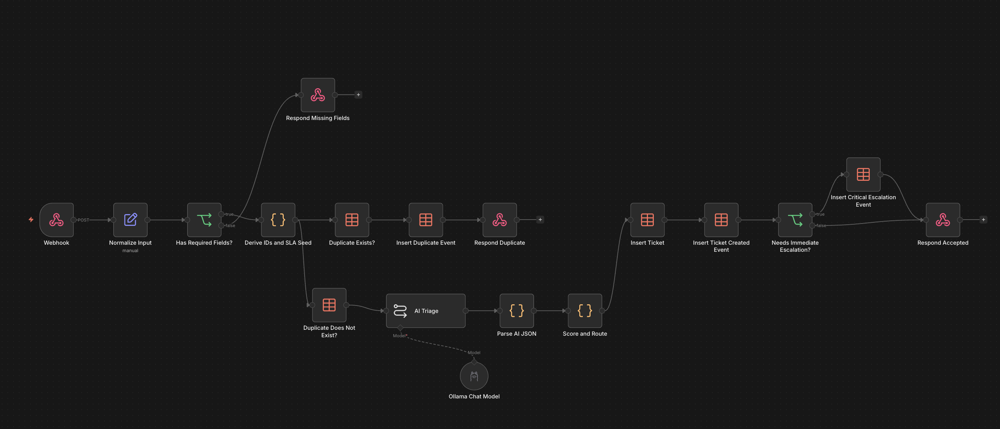
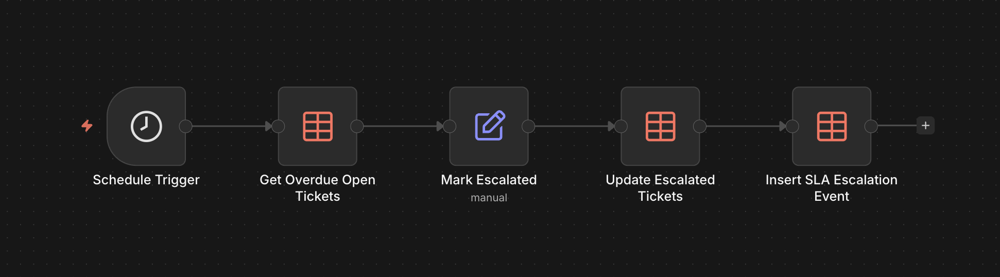
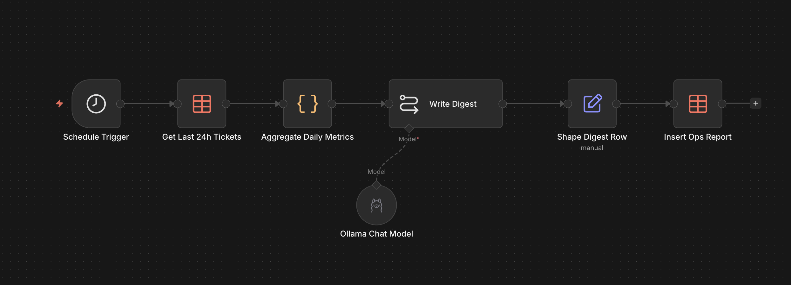
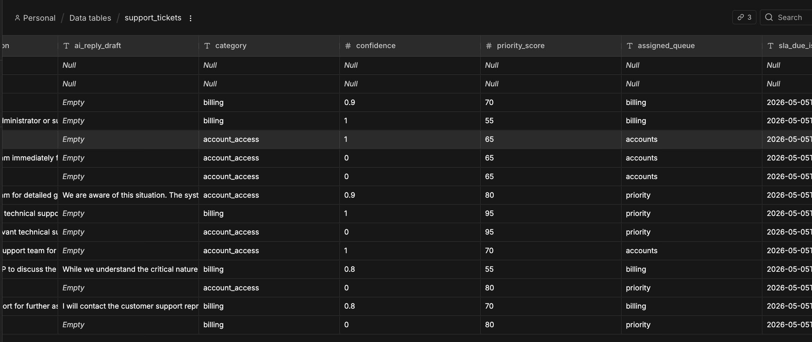
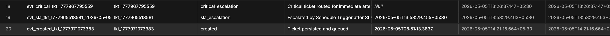

# 🤖 AI Support Triage — n8n Automation System

> An end-to-end, AI-powered customer support triage pipeline built entirely in [n8n](https://n8n.io). Incoming tickets are validated, deduplicated, classified by a local LLM, priority-scored, SLA-tracked, and reported on — all without writing a standalone backend.



---

## 📋 Table of Contents

- [Overview](#overview)
- [Architecture](#architecture)
- [Workflows](#workflows)
  - [1. Support Intake API](#1-support-intake-api)
  - [2. SLA Escalation Checker](#2-sla-escalation-checker)
  - [3. Daily Ops Digest](#3-daily-ops-digest)
  - [4. Error Monitor](#4-error-monitor)
- [Data Model](#data-model)
- [AI Triage Details](#ai-triage-details)
- [Priority Scoring Algorithm](#priority-scoring-algorithm)
- [SLA Policy](#sla-policy)
- [API Reference](#api-reference)
- [Setup & Prerequisites](#setup--prerequisites)
- [Importing Workflows](#importing-workflows)
- [Testing](#testing)
- [Tech Stack](#tech-stack)

---

## Overview

This project implements a **production-style support operations pipeline** using n8n workflows and a locally-hosted LLM (Ollama). It demonstrates how AI can be embedded into operational automation to:

- **Classify** tickets by category, urgency, and sentiment
- **Prioritize** tickets with a composite scoring algorithm
- **Route** tickets to the correct support queue automatically
- **Enforce SLAs** with scheduled breach detection and auto-escalation
- **Generate daily reports** summarizing operational health
- **Monitor errors** across the entire workflow system

All data is persisted in **n8n DataTables** — no external database required.

---

## Architecture

```
                                    ┌──────────────────────┐
                                    │   Error Monitor      │
                                    │  (catches failures   │
                                    │   across all flows)  │
                                    └──────────┬───────────┘
                                               │
    ┌──────────────────────────────────────────────────────────────────┐
    │                        n8n Instance                              │
    │                                                                  │
    │  ┌─────────────┐    ┌──────────────┐    ┌─────────────────────┐  │
    │  │  Support     │    │  SLA         │    │  Daily Ops          │  │
    │  │  Intake API  │    │  Escalation  │    │  Digest             │  │
    │  │  (webhook)   │    │  Checker     │    │  (9 AM daily)       │  │
    │  └──────┬───────┘    │  (every 15m) │    └──────────┬──────────┘  │
    │         │            └──────┬───────┘               │            │
    │         ▼                   ▼                       ▼            │
    │  ┌─────────────────────────────────────────────────────────────┐ │
    │  │                   n8n DataTables                            │ │
    │  │  ┌──────────────┐ ┌──────────────┐ ┌─────────────────────┐ │ │
    │  │  │support_tickets│ │support_events│ │   ops_reports       │ │ │
    │  │  └──────────────┘ └──────────────┘ └─────────────────────┘ │ │
    │  │  ┌──────────────┐                                          │ │
    │  │  │workflow_errors│                                          │ │
    │  │  └──────────────┘                                          │ │
    │  └─────────────────────────────────────────────────────────────┘ │
    │         ▲                                                        │
    │         │                                                        │
    │  ┌──────┴───────┐                                                │
    │  │  Ollama LLM  │                                                │
    │  │  (qwen2.5)   │                                                │
    │  └──────────────┘                                                │
    └──────────────────────────────────────────────────────────────────┘
```

---

## Workflows

### 1. Support Intake API

> **Trigger:** `POST /webhook/support/intake`  
> **Status:** Active  
> **Error Workflow:** Error Monitor

The core workflow. Accepts support tickets via a webhook, validates, deduplicates, classifies with AI, scores priority, and persists everything with a full audit trail.


#### Pipeline Steps

| Step | Node | Description |
|------|------|-------------|
| 1 | **Webhook** | Receives `POST` requests at `/webhook/support/intake` |
| 2 | **Normalize Input** | Extracts and normalizes fields: `source`, `customer_name`, `customer_tier`, `customer_email`, `subject`, `body`, `metadata_browser`, `metadata_account_id` |
| 3 | **Has Required Fields?** | Validates that `customer_email`, `subject`, and `body` are all non-empty. Returns a `400` error response if any are missing |
| 4 | **Derive IDs and SLA Seed** | Generates `ticket_id` (epoch-based), `duplicate_key` (email + normalized subject), `clean_text`, and timestamps |
| 5 | **Duplicate Check** | Parallel fan-out: checks `support_tickets` table for an existing `duplicate_key` |
| 5a | ↳ *Duplicate exists* | Logs a `duplicate_submission` event → responds with `"status": "duplicate"` |
| 5b | ↳ *No duplicate* | Proceeds to AI classification |
| 6 | **AI Triage** | Sends ticket content to **Ollama (qwen2.5:0.5b)** with a structured prompt. Returns category, urgency, sentiment, summary, recommended action, and a draft reply |
| 7 | **Parse AI JSON** | Extracts and validates the JSON from the LLM response (with regex fallback for non-clean output) |
| 8 | **Score and Route** | Computes a composite `priority_score` and assigns a `queue` and `sla_due` deadline |
| 9 | **Insert Ticket** | Persists the fully enriched ticket to `support_tickets` |
| 10 | **Insert Ticket Created Event** | Logs a `created` event to `support_events` |
| 11 | **Needs Immediate Escalation?** | If `priority_score ≥ 60`, logs a `critical_escalation` event |
| 12 | **Respond Accepted** | Returns the ticket summary, queue assignment, and AI draft reply to the caller |

---

### 2. SLA Escalation Checker

> **Trigger:** Schedule — every **15 minutes**  
> **Status:** Configurable (currently inactive)  
> **Error Workflow:** Error Monitor

Automatically detects tickets that have breached their SLA deadline and escalates them.



#### Pipeline Steps

| Step | Node | Description |
|------|------|-------------|
| 1 | **Schedule Trigger** | Fires every 15 minutes |
| 2 | **Get Overdue Open Tickets** | Queries `support_tickets` for rows where `status ≠ closed`, `escalated = false`, and `sla_due_epoch_ms ≤ now` |
| 3 | **Mark Escalated** | Sets `escalated = true` and `status = "escalated"` on each overdue ticket |
| 4 | **Update Escalated Tickets** | Writes the updated fields back to `support_tickets` |
| 5 | **Insert SLA Escalation Event** | Logs an `sla_escalation` event to `support_events` for each breached ticket |

---

### 3. Daily Ops Digest

> **Trigger:** Schedule — daily at **9:00 AM**  
> **Status:** Configurable (currently inactive)  
> **Error Workflow:** Error Monitor

Generates a daily executive summary of support operations using AI.



#### Pipeline Steps

| Step | Node | Description |
|------|------|-------------|
| 1 | **Schedule Trigger** | Fires daily at 9:00 AM |
| 2 | **Get Last 24h Tickets** | Fetches all tickets from the past 24 hours via `submitted_at_epoch_ms` |
| 3 | **Aggregate Daily Metrics** | Computes: total tickets, critical count, high-priority count, breakdowns by category, queue, and sentiment |
| 4 | **Write Digest** | Sends metrics to **Ollama (qwen2.5:0.5b)** to generate a concise markdown digest with watch-outs and recommended focus areas |
| 5 | **Shape Digest Row** | Formats the report with a `report_id`, period timestamps, and the markdown content |
| 6 | **Insert Ops Report** | Persists the digest to `ops_reports` |

---

### 4. Error Monitor

> **Trigger:** Error Trigger (fires on any workflow failure)  
> **Status:** Active (always-on)

A centralized error handler wired to all other workflows. Catches any execution failure and persists a structured error record.


#### Pipeline Steps

| Step | Node | Description |
|------|------|-------------|
| 1 | **Error Trigger** | Fires whenever any linked workflow fails |
| 2 | **Format Error Record** | Extracts `error_id`, `workflow_name`, `failed_node`, `error_message`, and `execution_url` |
| 3 | **Insert Workflow Error** | Persists the record to `workflow_errors` |

---

## Data Model

All data is stored in **n8n DataTables**. Four tables form the system's data layer:

### `support_tickets`

The primary ticket store. Each row represents one support request.

| Column | Type | Description |
|--------|------|-------------|
| `ticket_id` | string | Unique ID (e.g., `tkt_1777967795559`) |
| `customer_name` | string | Customer's display name |
| `customer_email` | string | Customer's email address |
| `customer_tier` | string | `standard`, `premium`, `enterprise` |
| `source` | string | Intake channel (e.g., `web_form`, `email`, `api`) |
| `subject` | string | Ticket subject line |
| `body` | string | Full ticket body |
| `clean_text` | string | Normalized subject + body for AI processing |
| `duplicate_key` | string | Dedup key: `email\|normalized-subject` |
| `category` | string | AI-assigned: `billing`, `bug`, `feature_request`, `account_access`, `integration`, `how_to`, `other` |
| `product_area` | string | AI-identified product area |
| `urgency_label` | string | `low`, `medium`, `high`, `critical` |
| `sentiment_label` | string | `negative`, `neutral`, `positive` |
| `language` | string | Detected language |
| `ai_summary` | string | One-line AI summary of the issue |
| `recommended_action` | string | AI-suggested next step |
| `ai_reply_draft` | string | AI-generated customer reply draft |
| `confidence` | number | AI confidence score (0.0–1.0) |
| `priority_score` | number | Composite priority score (0–100+) |
| `assigned_queue` | string | `general`, `billing`, `technical`, `accounts`, `priority` |
| `status` | string | `new`, `queued`, `escalated`, `closed` |
| `escalated` | boolean | Whether the ticket has been escalated |
| `submitted_at_iso` | string | ISO 8601 submission timestamp |
| `submitted_at_epoch_ms` | number | Epoch ms submission timestamp |
| `sla_due_iso` | string | SLA deadline (ISO 8601) |
| `sla_due_epoch_ms` | number | SLA deadline (epoch ms) |
| `metadata_browser` | string | Client browser info |
| `metadata_account_id` | string | Customer account ID |



### `support_events`

Immutable audit log. Every state change is recorded here.

| Column | Type | Description |
|--------|------|-------------|
| `event_id` | string | Unique event ID (e.g., `evt_created_tkt_...`) |
| `ticket_id` | string | Associated ticket ID |
| `event_type` | string | `created`, `duplicate_submission`, `critical_escalation`, `sla_escalation` |
| `event_note` | string | Human-readable description |
| `event_at_iso` | string | Timestamp of the event |



### `ops_reports`

Daily digest reports generated by the Daily Ops Digest workflow.

| Column | Type | Description |
|--------|------|-------------|
| `report_id` | string | Unique report ID |
| `period_start_iso` | string | Start of the 24h reporting window |
| `period_end_iso` | string | End of the reporting window |
| `total_tickets` | number | Total tickets in the period |
| `critical_count` | number | Number of critical tickets |
| `digest_markdown` | string | AI-written markdown summary |
| `created_at_iso` | string | When the report was generated |

### `workflow_errors`

Centralized error log for all workflow failures.

| Column | Type | Description |
|--------|------|-------------|
| `error_id` | string | Unique error ID |
| `workflow_name` | string | Name of the failed workflow |
| `failed_node` | string | Node that caused the failure |
| `error_message` | string | Error details |
| `execution_url` | string | Link to the failed execution in n8n |
| `created_at_iso` | string | Timestamp of the error |

---

## AI Triage Details

The **AI Triage** node uses a locally-hosted LLM via [Ollama](https://ollama.com) to classify each ticket. The model receives a structured prompt and returns strict JSON.

### Model

| Property | Value |
|----------|-------|
| Provider | Ollama (local) |
| Model | `qwen2.5:0.5b` |
| Output | Strict JSON (no markdown wrapping) |

### Classification Output Schema

```json
{
  "category": "billing",
  "product_area": "subscription management",
  "urgency_label": "high",
  "sentiment_label": "negative",
  "language": "English",
  "ai_summary": "Customer unable to update payment method, facing service interruption",
  "recommended_action": "Route to billing team for immediate payment method update assistance",
  "ai_reply_draft": "Hi [Customer], I understand the urgency...",
  "confidence": 0.85
}
```

### Allowed Values

| Field | Allowed Values |
|-------|---------------|
| `category` | `billing`, `bug`, `feature_request`, `account_access`, `integration`, `how_to`, `other` |
| `urgency_label` | `low`, `medium`, `high`, `critical` |
| `sentiment_label` | `negative`, `neutral`, `positive` |

### Fallback Parsing

If the LLM returns non-clean JSON (e.g., wrapped in markdown), the **Parse AI JSON** node uses a regex fallback to extract the first `{...}` block from the output.

---

## Priority Scoring Algorithm

The **Score and Route** node computes a composite priority score using multiple signals:

```
Priority Score = Urgency Points + Sentiment Bonus + Keyword Bonus + VIP Bonus
```

### Scoring Breakdown

| Signal | Condition | Points |
|--------|-----------|--------|
| **Urgency** | `critical` | +50 |
| | `high` | +35 |
| | `medium` | +20 |
| | `low` | +10 |
| **Sentiment** | `negative` | +15 |
| **Keywords** | Matches: `outage`, `down`, `cannot login`, `billing broken`, `security`, `data loss`, `payment failed` | +35 |
| **VIP Signals** | Matches: `enterprise`, `annual contract`, `founder`, `ceo`, `vp` | +10 |

### Queue Assignment

| Score Range | Queue | SLA |
|-------------|-------|-----|
| ≥ 80 | `priority` | 1 hour |
| 55–79 | Category-based | 4 hours |
| 30–54 | Category-based | 24 hours |
| < 30 | `general` | 72 hours |

### Category-to-Queue Mapping

| Category | Queue |
|----------|-------|
| `billing` | `billing` |
| `bug`, `integration` | `technical` |
| `account_access` | `accounts` |
| All others | `general` |

> **Note:** If `priority_score ≥ 80`, the queue is overridden to `priority` regardless of category.

---

## SLA Policy

SLA deadlines are computed at ticket creation time and enforced by the **SLA Escalation Checker** (runs every 15 minutes).

| Priority Score | SLA Window | Escalation Behavior |
|----------------|-----------|---------------------|
| ≥ 80 | **1 hour** | Immediate escalation at intake + SLA enforcement |
| 55–79 | **4 hours** | SLA enforcement only |
| 30–54 | **24 hours** | SLA enforcement only |
| < 30 | **72 hours** | SLA enforcement only |

When a ticket breaches its SLA:
1. The ticket's `status` is updated to `escalated`
2. The `escalated` flag is set to `true`
3. An `sla_escalation` event is logged to `support_events`

---

## API Reference

### Submit a Support Ticket

```
POST /webhook/support/intake
Content-Type: application/json
```

#### Request Body

```json
{
  "source": "web_form",
  "customer_name": "Jane Doe",
  "customer_tier": "premium",
  "customer_email": "jane@example.com",
  "subject": "Cannot access my dashboard",
  "body": "I've been locked out of my account since this morning. I've tried resetting my password but keep getting an error.",
  "metadata": {
    "browser": "Chrome 125",
    "account_id": "acc_12345"
  }
}
```

#### Required Fields

| Field | Required | Default |
|-------|----------|---------|
| `customer_email` | ✅ | — |
| `subject` | ✅ | — |
| `body` | ✅ | — |
| `source` | ❌ | `"unknown"` |
| `customer_tier` | ❌ | `"standard"` |
| `customer_name` | ❌ | — |
| `metadata.browser` | ❌ | `""` |
| `metadata.account_id` | ❌ | `""` |

#### Success Response (200)

```json
{
  "status": "accepted",
  "ticket_id": "tkt_1777967795559",
  "queue": "accounts",
  "priority_score": 65,
  "urgency_label": "high",
  "summary": "Customer locked out of dashboard, password reset failing",
  "reply_draft": "Hi Jane, I understand how frustrating it must be..."
}
```

#### Duplicate Response (200)

```json
{
  "status": "duplicate",
  "ticket_id": "tkt_1777967795559",
  "message": "A matching ticket already exists"
}
```

#### Validation Error Response (200)

```json
{
  "status": "error",
  "message": "Missing required fields: customer_email, subject, or body"
}
```

---

## Setup & Prerequisites

### Requirements

| Dependency | Purpose |
|------------|---------|
| [n8n](https://n8n.io) | Workflow automation platform (self-hosted or cloud) |
| [Ollama](https://ollama.com) | Local LLM inference server |
| `qwen2.5:0.5b` model | Lightweight model for ticket classification |

### 1. Install & Start Ollama

```bash
# Install Ollama (macOS)
brew install ollama

# Pull the model
ollama pull qwen2.5:0.5b

# Start the server (default: http://localhost:11434)
ollama serve
```

### 2. Set Up n8n

```bash
# Install via npm
npm install -g n8n

# Or run via Docker
docker run -it --rm -p 5678:5678 n8nio/n8n
```

### 3. Configure Ollama Credentials in n8n

1. Open n8n at `http://localhost:5678`
2. Go to **Settings → Credentials**
3. Create a new **Ollama API** credential
4. Set the base URL to `http://localhost:11434`

### 4. Create DataTables

Create the following DataTables in your n8n instance:

| Table Name | Description |
|------------|-------------|
| `support_tickets` | Primary ticket store |
| `support_events` | Audit event log |
| `ops_reports` | Daily digest reports |
| `workflow_errors` | Error records |

> Refer to the [Data Model](#data-model) section for the full column schemas.

---

## Importing Workflows

1. Open your n8n instance
2. Go to **Workflows → Import from File**
3. Import each JSON file from the `Workflows/` directory:
   - `Support Intake API.json`
   - `SLA Escalation Checker.json`
   - `Daily Ops Digest.json`
   - `Error Monitor.json`
4. Update the **DataTable IDs** in each workflow to match your newly created tables
5. Update the **Ollama credential** reference in the AI nodes
6. Activate the workflows

---

## Testing

### Quick Test with cURL

```bash
curl -X POST http://localhost:5678/webhook/support/intake \
  -H "Content-Type: application/json" \
  -d '{
    "source": "api_test",
    "customer_name": "Test User",
    "customer_tier": "premium",
    "customer_email": "test@example.com",
    "subject": "Payment failed on checkout",
    "body": "I tried to upgrade my plan but the payment keeps failing. This is urgent as my subscription expires today.",
    "metadata": {
      "browser": "Firefox 128",
      "account_id": "acc_test_001"
    }
  }'
```

### Test Validation (should return error)

```bash
curl -X POST http://localhost:5678/webhook/support/intake \
  -H "Content-Type: application/json" \
  -d '{
    "customer_name": "No Email User"
  }'
```

### Test Duplicate Detection

Run the first cURL command twice — the second call should return `"status": "duplicate"`.

---

## Tech Stack

| Component | Technology |
|-----------|-----------|
| **Workflow Engine** | n8n (self-hosted) |
| **AI / LLM** | Ollama + Qwen 2.5 (0.5B) — runs 100% locally |
| **Data Layer** | n8n DataTables (built-in, no external DB) |
| **API** | n8n Webhook node (REST) |
| **Scheduling** | n8n Schedule Trigger |
| **Error Handling** | n8n Error Trigger + centralized logging |
| **Language** | JavaScript (n8n Code nodes) |

---

## License

This project is open source and available under the [MIT License](LICENSE).

---

<p align="center">
  Built with ❤️ using <a href="https://n8n.io">n8n</a> and <a href="https://ollama.com">Ollama</a>
</p>
